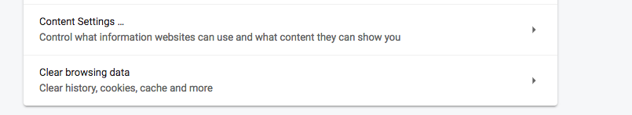
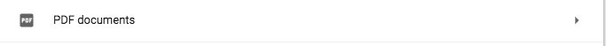
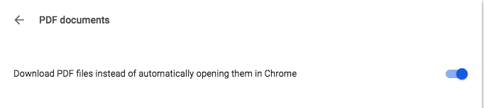

# JmiSchoolHack
* *this text will be italic*

 * _this text will also be italic_

 *  **this text should be bold**

 * __this text should also be bold__

 As abba said
 >kill me but donot kill my time

An to one of my quotes
>I am too lazy to write a quote here

And now comes the **Lists**
* onion
* potato
* gobhi
  * patta gobhi
  * fulgobhi
* kaddu

**_Now its time for ordered Lists_**

1.  piyaz
2.  aalu
3.  kaddu
4.  gobhi
    1.  patta gobhi
    2.  ful gobhi
5.  tamatar

>

>__click here__
>

>

>[An anchor ](https://linkedin.com/in/ibnjunaid)

* _Vanilla Js Function_

>```javascript
>function xyx(){
>    console.log('hello Markdown');
>}
>```
- [x] this is a completed item
- [ ] this work needs to be done :+1:

> First Header | Second Header
>------------ | -------------
>name | osama :sparkles:
>age  | 20 :rocket:

><span style="background-color:green;color:white;padding:2px;">some *This is Blue italic.* text</span>

><span style="background-color:dodgerblue;color:white;padding:2px;">some *This is Blue italic.* text</span>

><span style="background-color:magenta;color:white;padding:2px;">some *This is Blue italic.* text</span>

><span style ="background-color:red;color:white;padding:2pxl">Disclaimer</span>

<i style="background:black;color:white;padding:4px;border-left:5px solid green"> i am not responsible for any damage caused </i>

